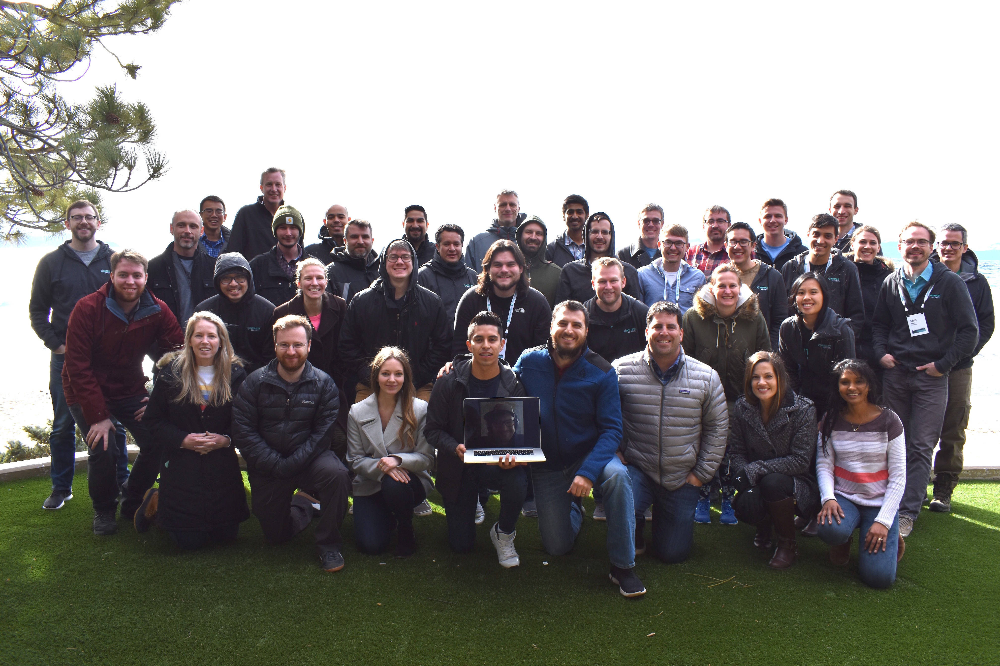
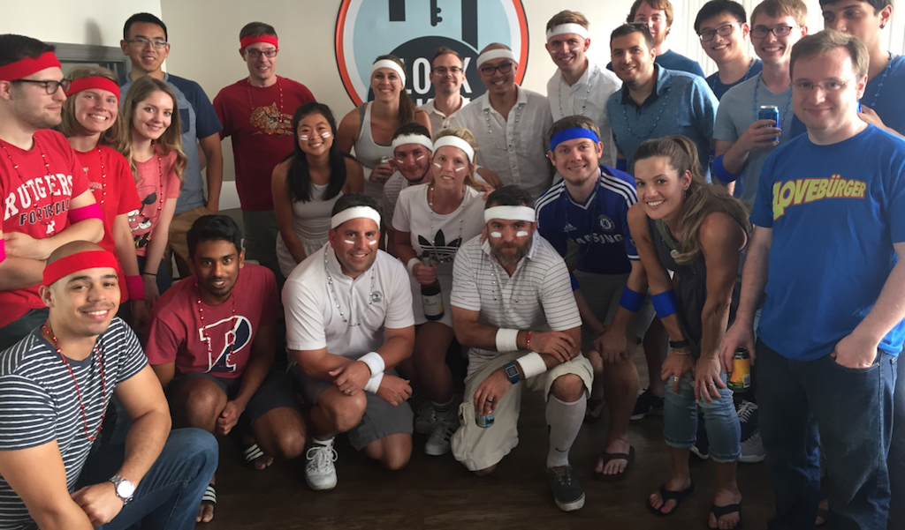

# Join the Team
At Contrast, our goal is the make the Internet safer day by day. We are always interested in meeting talented and creative technologists who share this goal. We've built some amazing technology thus far and are shaking up the way the world looks at application security. We know that our products can get better with new voices and ideas.

Are you looking to make a difference? Are you a problem solver, but want to be challenged with complex and interesting problems. Do you believe the best work is the result of finding the simplest solution to complex challenges? Do you long to be an early contributor to a product and a company culture? Do you ever wish you were there in the early days of these startups everyone is talking about?

If that's the case, we definitely want to [hear from you](https://www.contrastsecurity.com/careers)!

# Opportunities to Join the Team
We are always looking for talented engineers who want to come work with us. We have opportunities in the following areas:

* Language Specific Agent Engineers: We have opportunities for engineers who want to get under the covers of languages such as Java, C#, NodeJS, PHP, Go, Ruby and Python. 
* Front-End Development: Our UI is growing as our feature set expands. We are always interested in JavaScript enthusiasts. Today we specialize in AngularJS and Cordova. Tomorrow, maybe a swap to EmberJS or ReactJS. 
* Full-Stack Development: We've got data and have to scale to millions of transactions per minute. What's cooler than that? We love Java enthusiasts who like Spring, Hibernate, MySQL, Redis, ZooKeeper and tons of other fun technologies that make up our stack.
* User Experience and Interaction Design: Designers make our product better and are valued immensely at Contrast. You have a lot of freedom and responsibility to navigate the future of our products.
* Cloud Operations: Do you love automation? How about monitoring? Did we mention we scale our deployments to support millions of transactions?
* Digital Content: Our product is becoming more complex and our capabilities are bountiful. We need someone with an eye for teaching and a pen/tablet for writing.
* Support Engineer: Are you a forensic specialist? Do you like helping people out and making their product experience better?

We also have both summer and year-round [internships](interns.md) for developers, designers, researchers and data scientists. 

# Why Do We Have a Code Challenge?
Our philosophy is that life is an open book. We aren't real big on having you come in and write answers on a white board or code in real-time on a Google Doc. We like to give all of our candidates the chance to be creative and comfortable when putting their best foot forward as part of applying to be on our team. Working on a coding challenge in the comfort of your home, at a neighborhood coffee shop or wherever is our preference. Discussion and collaboration of your project will give you a sense of what it's like to work with us since it is how we review and provide feedback on each other's work internally.

Everyone who comes to work in Engineering at Contrast submits a coding challenge...Interns included! The best part of this coding challenge is that when you are done, you have a nice piece of code for the world to see in your Github account.

# How Do I Submit a Challenge?
Submitting a code challenge is simple and easy to do. Follow these steps below:

* Pick a [Challenge](challenges.md) that's just right for you and your interests.
* Commit your source with a fantastic README.md that anyone could use to get the project up and running.
* Try your hardest not to mention us as we value your privacy.
* Send us a link to your project.

# Questions/Issues
Sometimes our instructions are obvious to us, but might be confusing to others. No worries...in this case, feel free to submit an [issue or question](https://github.com/Contrast-Security-OSS/join-the-team/issues).
