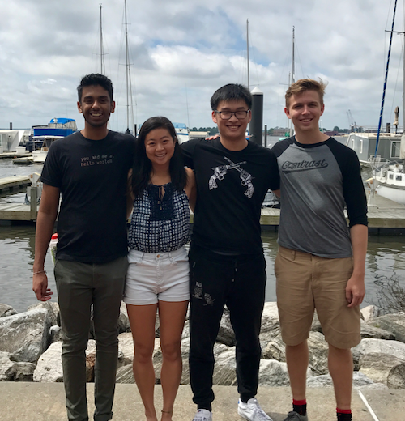

## The Contrast Internship Experience
Contrast offers a Silicon Valley like-experience from the 8th floor of the historic Natty Boh brewery in Canton. Interns will feel right at home working side by side with a highly collaborative group of engineering professionals. Lunch is provided daily, as are snacks and drinks. You will get the chance to experience the fast pace of startup life.

<a href="2017Interns.png" title="We love to have fun as a team.">

</a>

Candidates joining the team will work day to day with full-time staff members on one to two specific projects over the course of their internship. They will participate in our daily, agile exercises, as well as our show and tell sessions every two weeks. They will be able to either add materials to an external portfolio or Github site demonstrating their work. 

In our short, three year history, we've had great success with interns staying on with the team as full-time engineers.

## 2017-2018 Opportunities
Contrast Security has multiple internship opportunities for the 2017 academic calendar for part-time and full-time undergraduate or graduate students pursuing a post graduate career in cyber-security, cloud-based software development and/or User Experience (Product Design). Three specific opportunities are available for candidates to work as:

* User Experience (UX) Designer
* Software Engineer
* Security Researcher
* Data Science

### UX Designer
Our User Experience team is primarily responsible for designing and directing the front-end of our applications and key workflows our customers make use of when working on our products. This team performs a variety of tasks such as front-end mock-ups and wireframes, customer research, accessibility research, A/B testing, as well as CSC/JavaScript library research.

We have multiple internship projects to work on:

* Designing high-fidelity mocks-ups and designs of a mobile version of our product.
* Multiple usability studies
* Customer research project about upcoming features
* Other wireframe and design projects for upcoming features
* General QA Testing and Verification of New Features
* Design 1 cartoon cat for [OpenCats](http://contrast-security-oss.github.io/meow/index.html) “Meow Project”
* Work on OpenDocs imaging

### Software Engineer
We have software engineering opportunities for computer science majors interested in working on both web-based applications, RESTful services and software build system plugins.

We have multiple internship projects to work on:

* Authoring open source full-stack sample applications in either Java, NodeJS, Ruby, Python or GoLang.
* Writing 3rd party integrations using our open source SDKs by language.
* Exploring 3rd party libraries and SDKs from companies like Github, Slack, Atlassian, Splunk and SumoLogic

### Security Researcher
Many of our engineers have a deep, rich experience in the field of application discovery. They have been part of research teams responsible for uncovering zero-day exploits. They have contributed extensive research to the AppSec and OWASP community about authoring secure and scalable web applications. 

We have multiple internship projects to work on:

* Researching the latest Common Vulnerability and Exposures (CVEs) for impact and exposure.
* Penetration testing exercise against Contrast’s main web application.
* Evaluation of multiple, popular open source projects leveraging Contrast’s IAST and RASP engine modes for analyzing exposure to vulnerabilities and attacks.

### Data Science
Data science is an area of growth and opportunity at Contrast. We have only begun to scratch the surface of data exploration. We are looking for like-minded people looking to explore our sources of data for key projects and initiatives. We would love candidates with coding skills in Python, R and/or SQL. Ideal candidates will have a strong academic background as well as technical skills including MapReduce programming, statistics or machine learning.

## Applying to the Internship Program
The fastest and easiest way to apply to our program is to send an email to [careers@contrastsecurity.com](mailto:careers@contrastsecurity.com). Attach a PDF version of your resume and a short cover letter as to which role you would like to apply. Make sure to put in the subject "Contrast Security Engineering Internship Program". Upon receiving your resume, someone on the team will get back to you quickly. 

If your school is using Handshake, you can apply via this [link](https://app.joinhandshake.com/jobs/876217).

Our internship process is pretty straightforward. Every candidate interested in applying for the internship will also have to complete a project prior to an on-site or video (for those out-of-town) interview. We have several [projects](challenges.md) for candidates to consider. We recommend that most interns pick project number one.
