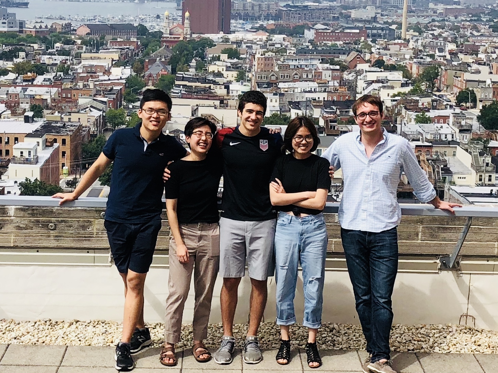

## The Contrast Internship Experience
[Contrast Security](https://stackoverflow.com/jobs/companies/contrast-security) offers a Silicon Valley like-experience from the 4th floor of the majestic Brown's Wharf in the Fells Point neighborhood of Baltimore, Maryland. Interns will feel right at home working side by side with a highly collaborative group of engineering professionals. Lunch is provided daily, as are snacks and drinks. You will definitely get the chance to experience the fast pace of startup life.

<a href="2017Interns.png" title="We love to have fun as a team.">

</a>

Our internship program has been highly successful over our 4+ year history with several members of each class receiving the opportunity to move onto the team in a full-time capacity upon graduation. The internship is optimal for rising seniors and/or December graduates specializing in Computer Science. 

The internship program is divided into 3 phases, with each phase lasting 3-4 weeks. We have 4-5 spots for the 2019 internship program. Each month of the program, an intern will be paired with a member of the engineering team as their mentor. Over the course of the internship, each intern will have (3) mentors guiding the entire experience. 

Our internship runs from the beginning of June through mid-August. Any student available in May may start the program earlier and is encouraged. Due to the shortness of the program, we will not be able to accommodate any extended vacations.

## Summer 2019 Opportunities
Contrast Security has multiple internship opportunities for the 2018-2019 academic calendar for part-time and full-time undergraduate or graduate students pursuing a post graduate career in cloud-based software development, cyber-security and/or User Experience (Product Design). The specific opportunities are available for candidates to work as:

* Software Engineer
* User Experience (UX) Designer
* Security Researcher
* Data Science

### Software Engineering
Our software engineering interns go through an elaborate, yet fun 3-month program with an emphasis in preparation for a career in agile software development. Below is a breakdown of the experience month by month.

**Phase #1: Software Design, Planning and Prototyping**
The first month in the program will entail designing the summer's main project. The team will collaborate with 2-3 full-time engineers to determine the project's requirements and from that exercise will put together a series of design used for implementing the project. From this initial design, the team will work together to breakdown the work into smaller units and then provide scoping and estimation.

The team will also prototype during this time knowing that much of the code they produce maybe replaced at later stages of the project.

This first phase is intended to help our interns get comfortable working in a collaborative, agile development environment.

**Phase #2: Contrast Product/Feature Development**
Once the team has defined their project scope and assigned resources, the majority of the internship is spent working collaboratively on their coding assignments. Our program is designed for collaboration at all stages. Some of our interns practice pair programming, but for the most part assignments are worked across 2 team members collaboratively.

**Phase #3: Open Source Development and Project Presentation**
Every class in our 4+ year history of our summer internship program has produced an Open Source code artifact. Sometimes this happens at the beginning of the program, but more often than not it happens at the end of the program. Interns are expected to push one or more projects associated with their primary summer project to the Contrast Github site.

At the end of the internship the group presents their entire portfolio of work to all of engineering, members of the executive team and members of the Board of Directors. This usually takes place during the last week of the program and is followed by an Intern Appreciation Party.

### Security Researcher
Many of our engineers have a deep, rich experience in the field of application discovery. They have been part of research teams responsible for uncovering zero-day exploits. They have contributed extensive research to the AppSec and OWASP community about authoring secure and scalable web applications. 

We have multiple internship projects to work on:

* Researching the latest Common Vulnerability and Exposures (CVEs) for impact and exposure.
* Penetration testing exercise against Contrast’s main web application.
* Evaluation of multiple, popular open source projects leveraging Contrast’s IAST and RASP engine modes for analyzing exposure to vulnerabilities and attacks.

### UX Designer
Our User Experience team is primarily responsible for designing and directing the front-end of our applications and key workflows our customers make use of when working on our products. This team performs a variety of tasks such as front-end mock-ups and wireframes, customer research, accessibility research, A/B testing, as well as CSC/JavaScript library research.

We have multiple internship projects to work on:

* Designing high-fidelity mocks-ups and designs of a mobile version of our product.
* Multiple usability studies
* Customer research project about upcoming features
* Other wireframe and design projects for upcoming features
* General QA Testing and Verification of New Features
* Design 1 cartoon cat for [OpenCats](http://contrast-security-oss.github.io/meow/index.html) “Meow Project”
* Work on OpenDocs imaging

### Data Science
Data science is an area of growth and opportunity at Contrast. We have only begun to scratch the surface of data exploration. We are looking for like-minded people looking to explore our sources of data for key projects and initiatives. We would love candidates with coding skills in Python, R and/or SQL. Ideal candidates will have a strong academic background as well as technical skills including MapReduce programming, statistics or machine learning.

## Applying to the Internship Program
The fastest and easiest way to apply to our program is to apply online [here](https://jobs.lever.co/contrastsecurity/ee23b08c-afe0-47d9-9811-f571eb63c82d). Attach a PDF version of your resume and a short cover letter as to which role you would like to apply. Make sure to put in the subject "Contrast Security Engineering Internship Program". Upon receiving your resume, someone on the team will get back to you quickly. 

If your school is using Handshake, you can apply via this [link](https://app.joinhandshake.com/jobs/1750818) or feel free to use our link from [Lever](https://jobs.lever.co/contrastsecurity/ee23b08c-afe0-47d9-9811-f571eb63c82d).

Our internship process is pretty straightforward. We start by reviewing your resume. Those resumes selected will then be contacted for an introductory phone call to talk about the program and answer any questions you may have about Contrast and/or the internship program. 

Candidates selected to the next phase will be given the option of submitting a [projects](challenges.md) which they will have until the end of October to complete, or they could opt for the technical interview. While we do encourage candidates to work on the project, we understand that sometimes our academic schedules are too rigourous and thus a technical interview may all you can afford timewise. 

Our goal is to wrap-up all interviews before late October. We will announce our 2018 class within the first two weeks of November.

