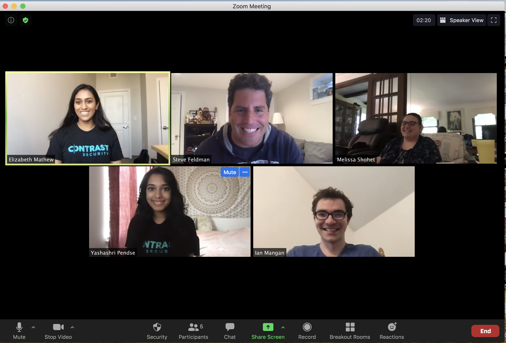
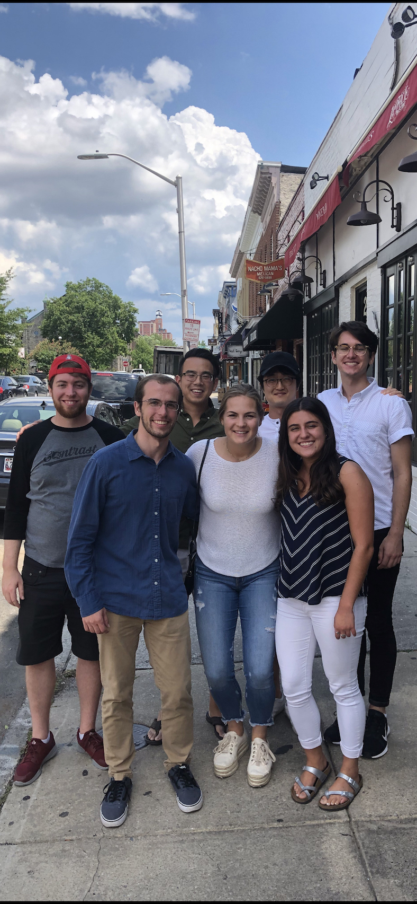

## The Contrast Internship Experience
[Contrast Security](https://stackoverflow.com/jobs/companies/contrast-security) offers a Silicon Valley like-experience from the 4th floor of the majestic Brown's Wharf in the Fells Point neighborhood of Baltimore, Maryland. Interns will feel right at home working side by side with a highly collaborative group of engineering professionals. Lunch is provided daily, as are snacks and drinks. You will definitely get the chance to experience the fast pace of startup life.

<a href="images/2017Interns.png" title="We love to have fun as a team.">

</a>

Our internship program has been highly successful over our 5+ year history with several members of each class receiving the opportunity to move onto the team in a full-time capacity upon graduation. The internship is optimal for rising seniors and/or December graduates majoring in Computer Science. We've had over 20 interns from such great Universities as Carnegie Mellon, Johns Hopkins, UPenn, Pittsburg, UMD-College Park, Towson, Virginia Tech, Delaware, University of Chicago, Loyola College, University of Wisconsin and Dartmouth College.

The internship program is divided into 3 phases, with each phase lasts roughly 3-4 weeks. We ask all candidates that apply to prepare for a summer experience from late May until mid-August. The program lasts 12 weeks. Participants can start early and stay longer. We have 5 spots for the 2020 internship program. Due to the short amount of time and the intensity of the program, we let all candidates know that they will be required to commit to the entire program with no breaks for extended vacation beyond the company holidays (Memorial Day and Independence Day).

Each month of the program, an intern will be paired with a member of the engineering team as their mentor. Over the course of the internship, each intern will have (3) mentors guiding the entire experience.

## About Our Internship
Our software engineering interns go through an elaborate, yet fun 3-month program with an emphasis in preparation for a career in agile software development. Below is a breakdown of the experience month by month.

**Phase #1: Software Design, Planning and Prototyping**
The first month in the program will entail designing the summer's main project. The team will collaborate with 2-3 full-time engineers to determine the project's requirements and from that exercise will put together a series of design used for implementing the project. From this initial design, the team will work together to breakdown the work into smaller units and then provide scoping and estimation.

The team will also prototype during this time knowing that much of the code they produce maybe replaced at later stages of the project.

This first phase is intended to help our interns get comfortable working in a collaborative, agile development environment.

**Phase #2: Contrast Product/Feature Development**
Once the team has defined their project scope and assigned resources, the majority of the internship is spent working collaboratively on their coding assignments. Our program is designed for collaboration at all stages. Some of our interns practice pair programming, but for the most part assignments are worked across 2 full-time team members collaboratively.

**Phase #3: Project Presentation**
At the end of the internship the group presents their entire portfolio of work to all of engineering, members of the executive team and members of the Board of Directors. This usually takes place during the last week of the program and is followed by an Intern Appreciation Party.

## Applying to the Internship Program
The fastest and easiest way to apply to our program is to apply online [here](https://jobs.lever.co/contrastsecurity/035fee59-5146-4bb6-8d55-7a4a20c43d5b). Attach a PDF version of your resume and a short cover letter as to which role you would like to apply. Make sure to put in the subject "Contrast Security Engineering Internship Program". Upon receiving your resume, someone on the team will get back to you quickly.

If your school is using Handshake, you can apply via this [link](https://app.joinhandshake.com/jobs/2947586) or feel free to use our link from [Lever](https://jobs.lever.co/contrastsecurity/035fee59-5146-4bb6-8d55-7a4a20c43d5b).

## Interview Application Schedule

| Application Process                        | Dates         | Notes/Expectations                                                                                                                                                                                  |
|--------------------------------------------|---------------|-----------------------------------------------------------------------------------------------------------------------------------------------------------------------------------------------------|
| Accepting Resumes                          | 8/31 - 10/19  | We can accept resumes via [Lever](https://jobs.lever.co/contrastsecurity/035fee59-5146-4bb6-8d55-7a4a20c43d5b) or [HandShake](https://app.joinhandshake.com/jobs/3017837).                          |
| Informational Calls and Career Fair Visits | 9/7 - 10/03    | Contrast engineers will be available for information calls for those students unable to meet with us at the various career fairs we attended this fall.  This year Contrast will be attending Carnegie Mellon's TOC Fail, JHU's STEM Fair, University of Delaware's Career Fair, Rose Hulman's Career Fair and University of Pittsburg's Career Fair.|                                           |
| Interviews                                 | 09/28 - 10/23 | The interview will take place online via video or in person for those local and able to come into the office. We encourage local candidates to travel to the Contrast office for the interview and a chance to meet the team in-person.|
| Class Announced and Offer Letters Sent Out                     | 10/30 - 11/9   | We will announce our class.                                                                                                                                                                         |
