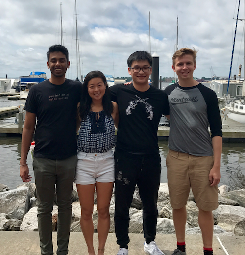
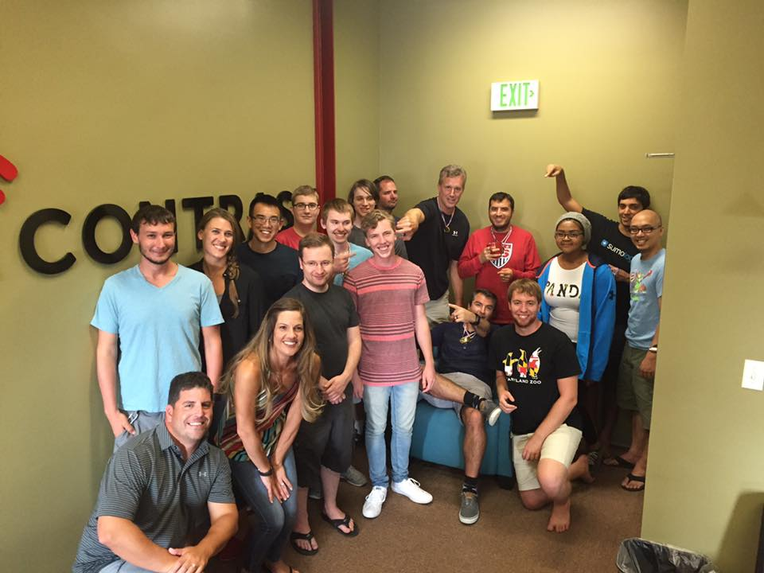

## The Contrast Internship Experience
[Contrast Security](https://stackoverflow.com/jobs/companies/contrast-security) offers a Silicon Valley like-experience from the 4th floor of the majestic Brown's Wharf in the Fells Point neighborhood of Baltimore, Maryland. Interns will feel right at home working side by side with a highly collaborative group of engineering professionals. Lunch is provided daily, as are snacks and drinks. You will definitely get the chance to experience the fast pace of startup life.

<a href="images/2017Interns.png" title="We love to have fun as a team.">

</a>

Our internship program has been highly successful over our 4+ year history with several members of each class receiving the opportunity to move onto the team in a full-time capacity upon graduation. The internship is optimal for rising seniors and/or December graduates majoring in Computer Science. 

The internship program is divided into 3 phases, with each phase lasting 3-4 weeks. We have 4-5 spots for the 2019 internship program. Each month of the program, an intern will be paired with a member of the engineering team as their mentor. Over the course of the internship, each intern will have (3) mentors guiding the entire experience. 

Our internship runs from the beginning of June through mid-August. Any student available in May may start the program earlier and is encouraged. Due to the shortness of the program, we will not be able to accommodate any extended vacations.
 

## About Our Internship
Our software engineering interns go through an elaborate, yet fun 3-month program with an emphasis in preparation for a career in agile software development. Below is a breakdown of the experience month by month.

**Phase #1: Software Design, Planning and Prototyping**
The first month in the program will entail designing the summer's main project. The team will collaborate with 2-3 full-time engineers to determine the project's requirements and from that exercise will put together a series of design used for implementing the project. From this initial design, the team will work together to breakdown the work into smaller units and then provide scoping and estimation.

The team will also prototype during this time knowing that much of the code they produce maybe replaced at later stages of the project.

This first phase is intended to help our interns get comfortable working in a collaborative, agile development environment.

**Phase #2: Contrast Product/Feature Development**
Once the team has defined their project scope and assigned resources, the majority of the internship is spent working collaboratively on their coding assignments. Our program is designed for collaboration at all stages. Some of our interns practice pair programming, but for the most part assignments are worked across 2 team members collaboratively.

**Phase #3: Open Source Development and Project Presentation**
Every class in our 4+ year history of our summer internship program has produced an Open Source code artifact. Sometimes this happens at the beginning of the program, but more often than not it happens at the end of the program. Interns are expected to push one or more projects associated with their primary summer project to the Contrast Github site.

At the end of the internship the group presents their entire portfolio of work to all of engineering, members of the executive team and members of the Board of Directors. This usually takes place during the last week of the program and is followed by an Intern Appreciation Party.

## Applying to the Internship Program
The fastest and easiest way to apply to our program is to apply online [here](https://jobs.lever.co/contrastsecurity/035fee59-5146-4bb6-8d55-7a4a20c43d5b). Attach a PDF version of your resume and a short cover letter as to which role you would like to apply. Make sure to put in the subject "Contrast Security Engineering Internship Program". Upon receiving your resume, someone on the team will get back to you quickly. 

If your school is using Handshake, you can apply via this [link](https://app.joinhandshake.com/jobs/2947586) or feel free to use our link from [Lever](https://jobs.lever.co/contrastsecurity/035fee59-5146-4bb6-8d55-7a4a20c43d5b).

## Interview Application Schedule

| Application Process                        | Dates         | Notes/Expectations                                                                                                                                                                                  |
|--------------------------------------------|---------------|-----------------------------------------------------------------------------------------------------------------------------------------------------------------------------------------------------|
| Accepting Resumes                          | 8/31 - 10/19  | We can accept resumes via [Lever](https://jobs.lever.co/contrastsecurity/ee23b08c-afe0-47d9-9811-f571eb63c82d) or [HandShake](https://app.joinhandshake.com/jobs/1750818).                          |
| Informational Calls and Career Fair Visits | 9/7 - 9/30    | Contrast engineers will be available for information calls for those students unable to meet with us at the various career fairs we attended this fall.                                             |
| Application Projects Due                   | 10/24         | See project details below.                                                                                                                                                                          |
| Interviews                                 | 10/22 - 10/30 | Once your project is submitted, we will schedule an interview to review your project. The interview will take place online via video or in person for those local and able to come into the office. |
| Offer Letters Sent Out                     | 11/5 - 11/9   | We will announce our class.                                                                                                                                                                         |

# Summer Internship Interview Project
Our summer internship program is designed to give rising seniors the opportunities to enhance their experience working with two or more software languages. We set the expectation that language specialization is a thing of the past. We want to encourage all candidates and future interns to become language polyglots.

Most university programs believe in this philosophy as well. Many Computer Science programs provide foundational object-oriented programming in either C++ or Java. They offer complementary exposure to C. Some programs focus on Python and/or OCAML. 

For our interview project, we would like for you to build a simple, yet elegant web application that visualizes a security intelligence data feed (vulnerabilities or threat intelligence data). It should contain both a UI and a service layer. You will likely get the chance to work in 2 languages (JavaScript + Another Language).

The project can take anywhere from 4 to 12 hours to complete. Note that the project isn't necessarily indicative of the work you would do during the internship. It's a simple project that any 3rd year CS major should be able to successfully complete with a little bit of free time. As the author of this project, you own the code and get to put it in your GitHub portfolio.

**About the UI**

We ask that your UI contains at least:

* Map if you are visualizing geo-location data that can zoom in/out
* Grid control (aka...a table of data) to present the data presented in the map
* Search of data to change the presentation in the map and grid.

It should be a clean UI written in one of the recommended JS frameworks below. You can write the service layer in the language of your choice.

Feel free to use any of the these JavaScript frameworks:
* Angular
* React
* Vue
* Meteor
* Ember 

**About the Service Layer**

You can use any language you like for the service layer. It can be a simple REST interface or if you are really interested, build a GraphQL interface. Most submissions are written in either Java, Python, NodeJS, Ruby or GoLang. 

**About Your Data Set**

We recommend that you identify one or more data feeds from one of these three sources. You can simply store the data in a JSON file or even host it in a free service like Firebase or AWS Cognito. It's totally up to you.

* Interesting [GitHub Project with Curated Threat Intelligence Feeds](https://github.com/hslatman/awesome-threat-intelligence)
* [National Vulnerability Database](https://nvd.nist.gov/vuln/data-feeds)
* Choose or recommend an alternate data set.

**Final Requirements**

Additional requirements as part of our craftsmanship initiative:
* Make sure to write an amazing README in your GitHub project that explains what your built, why you built it, how to set it up and how to use it.
* Unit tests
* Integration tests of your service layer
* CI Pipeline to compile, build, test and report in [Travis CI](https://travis-ci.com/) which is free for any Open Source project in GitHub

